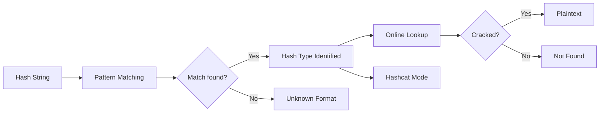

# HashLookup

Hash identification and online lookup tool. Identifies hash types from format patterns and queries online databases (crackstation, hashes.com).

## How it works



## Quick Start

```bash
# Identify a hash
python3 hashlookup.py -i d41d8cd98f00b204e9800998ecf8427e

# Compute hashes
python3 hashlookup.py -c "hello" -a md5

# Online lookup (needs requests)
python3 hashlookup.py -l -i 5d41402abc4b2a76b9719d911017c592

# Hashcat mode numbers
python3 hashlookup.py -i '$2b$12$LJ3m4ys3Lk' --hashcat-mode

# Read hash from file
python3 hashlookup.py -f hash.txt -i

# Save results
python3 hashlookup.py -i myhash -o results.json
```

## Supported Hash Types

| Type | Length | Pattern |
|------|--------|---------|
| MD5 | 32 hex | `[a-f0-9]{32}` |
| SHA1 | 40 hex | `[a-f0-9]{40}` |
| SHA256 | 64 hex | `[a-f0-9]{64}` |
| SHA512 | 128 hex | `[a-f0-9]{128}` |
| bcrypt | 60 chars | `$2[aby]$...` |
| NTLM | 32 hex | Same as MD5 (ambiguous) |
| MySQL3 | 16 hex | `[a-f0-9]{16}` |
| SHA256-Crypt | variable | `$5$...` |
| SHA512-Crypt | variable | `$6$...` |

## Project Structure

```
HashLookup/
├── hashlookup.py
├── README.md
├── LICENSE
├── requirements.txt
├── tests/
│   └── test_hashlookup.py
└── docs/
    └── engineering-report.md
```

## License

MIT
